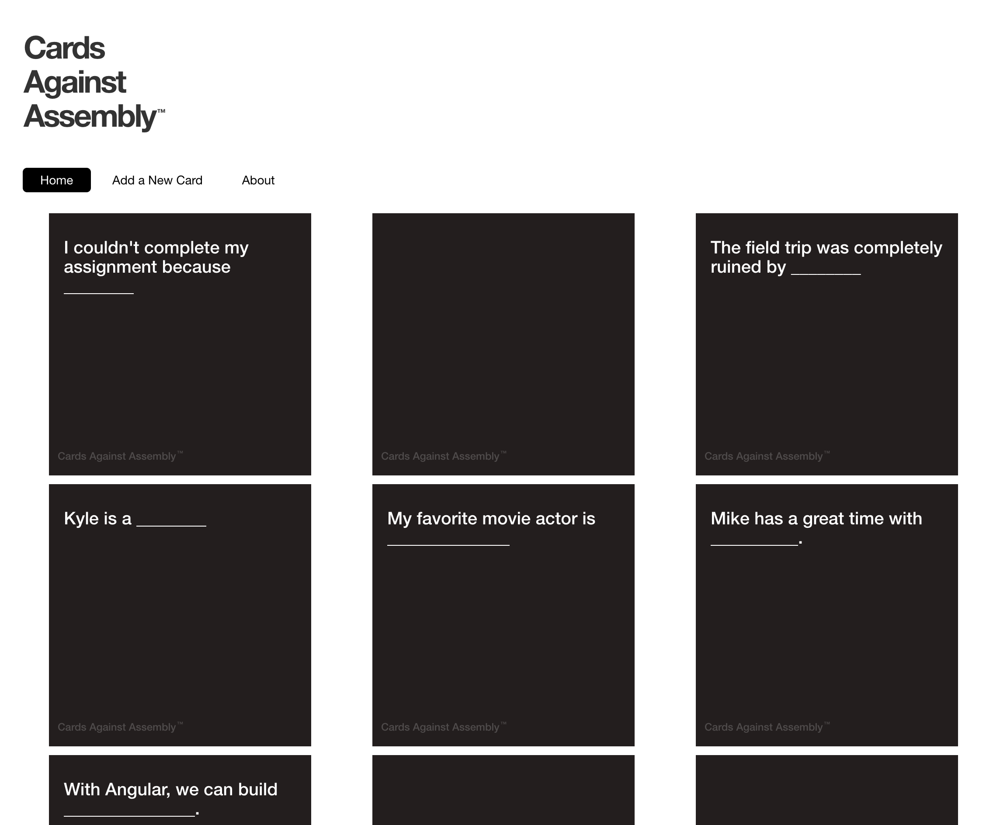

# Cards Against Assembly

> Angular 4 Version

## Preparation 

- [Angular CLI](https://cli.angular.io/)
- Understanding of fundamental concepts for Angular 2+

## Demo

> [ga-cards.herokuapp.com](https://ga-cards.herokuapp.com/)

Cards are user generated and initially appear face down until a user clicks on the card, which then reveals it.



## Cards API 

- **GET** [https://ga-cards.herokuapp.com/cards](https://ga-cards.herokuapp.com/cards)
	- Note: Older cards don't have a `createdAt` value

```json
[
  {
    "_id": "5631462be4b07f34b0915a0c",
    "question": "I couldn't complete my assignment because ________"
  },
  {
    "_id": "56314647e4b07f34b0915a1c",
    "question": "I get by with a little help from ________"
  },
  {
    "_id": "5631465fe4b07f34b0915a1f",
    "question": "The field trip was completely ruined by ________"
  },
  {
    "_id": "590231880f48d5419f94f4fc",
    "question": "It was the best of _________, it was the worst of ________.",
    "createdAt": "2017-04-27T17:59:36.595Z",
    "__v": 0
  },
  {
    "_id": "590231caab657d0c98036421",
    "question": "I'm very bad at this because _________",
    "createdAt": "2017-04-27T18:00:42.162Z",
    "__v": 0
  }
]
```

- **POST** [https://ga-cards.herokuapp.com/cards](https://ga-cards.herokuapp.com/cards)
	- Parameter: `question` - **required** - Question to add

## Adding Dependencies

- Navigate to the [starter code](./starter/ga-cards/) and install dependencies with `$ npm i`
- The app uses [Bootstrap](https://getbootstrap.com/), so add Bootstrap either locally or through a CDN within the base **index.html** page 

## Plan Components 

- Look through the mockup and figure out what components our app will require 

```html
<app-root>
  <app-header></app-header>
  <app-nav></app-nav>
	
  <!-- cards state -->
  <app-cards>
    <app-card></app-card>
    <app-card></app-card>
  </app-cards>
	
  <!-- add card state -->
  <app-add-card></app-add-card>
	
  <!-- about state -->
  <app-about></app-about>
	
  <app-footer></app-footer>
</app-root>
```

## Create Components 

Generate the components we'll need:

- `$ ng g c header`
- `$ ng g c nav`
- `$ ng g c cards`
- `$ ng g c card`
- `$ ng g c add-card`
- `$ ng g c about`
- `$ ng g c footer`

### Exercise (20 min)

- Fill in the placeholder components with the static HTML from our mockups
- Seperate the CSS in our **main.css** file to the relevant components

NOTE: Don't worry about the `<app-card>` component for now, we'll come back to that. 

## Router Setup

- Add an outlet to where new content should appear on state changes in **app.component.html**

```html
<!-- app.component.html -->
<router-outlet></router-outlet>
```

- Create the file **src/app/app-routing.module.ts**
- Import router dependencies: 

```js
// app-routing.module.ts
import { NgModule } from '@angular/core';
import { RouterModule, Routes } from '@angular/router';
```

- Import components required: 

```js
// app-routing.module.ts
import { CardsComponent } from './cards/cards.component';
import { AddCardComponent } from './add-card/add-card.component';
import { AboutComponent } from './about/about.component';
```

- Configure routes 

```js
// app-routing.module.ts
const routes: Routes = [
  {
    path: 'about',
    component: AboutComponent
  },
  {
    path: 'add-card',
    component: AddCardComponent
  },
  {
    path: 'cards',
    component: CardsComponent
  },
  {
    path: '**',
    redirectTo: '/cards'
  }
];
```

- Create the router 

```js
// app-routing.module.ts
@NgModule({
  imports: [ RouterModule.forRoot(routes) ],
  exports: [ RouterModule ]
})
export class AppRoutingModule {}
```

- Within **src/app/app.module.ts** import the `AppRoutingModule` file

```js
// app.module.ts
import { AppRoutingModule } from './app-routing.module';
```

- Import the `AppRoutingModule` into the core app component 

```js
// app.module.ts
// ...
  imports: [
    BrowserModule,
    AppRoutingModule
  ]
// ...
```

- Test our routes: 
  - [http://localhost:4200/cards](http://localhost:4200/cards)
  - [http://localhost:4200/add-card](http://localhost:4200/add-card)
  - [http://localhost:4200/about](http://localhost:4200/about) - Check the styling for the card!
  - [http://localhost:4200/fake-route-that-does-not-exist](http://localhost:4200/fake-route-that-does-not-exist)

- Update our navigtion links to use the router: 

```html
<!-- nav.component.html -->
<a routerLink="/about">About</a>
```

We still have a problem though, our active link is showing as **Home** and not changing as the user clicks the different links. 😢

### Exercise (15 min)

Figure out a way we can set the active link for the navigation items. We need to set a class of `active` on the currently active link. 

Are you stuck? [Click here for a hint](https://angular.io/api/router/RouterLinkActive)

## The Card Component

Change the `CardsComponent` so that it's using the `CardComponent`

```html
<!-- cards.component.html -->
<section id="cards" class="container-fluid">
  <div class="row">
    <app-card></app-card>
    <app-card></app-card>
    <app-card></app-card>
  </div>
</section>
```

We have an issue, every card is the same which doesn't make for an interesting game. Let's fix that by thinking about how we would want to use the `<app-card>` component. We might think about projecting content in this manner: 

```html
<app-card>CODA is like ___________</app-card>
```

Change the cards to allow passing in a question.

```html
<!-- cards.component.html -->
<section id="cards" class="container-fluid">
  <div class="row">
    <app-card>CODA is like ___________</app-card>
    <app-card>Today is ___________</app-card>
    <app-card>Mike is too cool for ___________</app-card>
  </div>
</section>
```

Change **card.component.html** to use projection by replacing the hard-coded question with:

```html
<ng-content></ng-content>
```

## Configure Environment Variables

When we generate a project using the Angular CLI, we're provided with files we can use to configure values depending on what environment we're building for. 

Let's add in a value for our API base URL so this could change depending on whether the code is running in development or production. We'll use this in the service we create next. 

```js
// environments/environment.ts
export const environment = {
  production: false,
  apiBaseUrl: 'https://ga-cards.herokuapp.com'
};
```

## Card Service

Let's develop an Angular service that can be used by all components in our application. 

```
$ ng g s card
```

Import the CardService to **app.module.ts** and add it as a provider in the `providers` array. 

```js
// app.module.ts
import { CardService } from './card.service';
```

Import the HttpModule to **app.module.ts** and add it to the `imports` array.  

```js
// app.module.ts
import { HttpModule } from '@angular/http';
```

Import our environment variables to use within our service. 

```js
// card.service.ts
import { environment } from '../environments/environment';
```

Create a method called `getCards()` to make a request to our Cards API. This is what our service should look like now:

```js
// card.service.ts
import { Injectable } from '@angular/core';

import { environment } from '../environments/environment';
import { Http } from '@angular/http';

@Injectable()
export class CardService {

  constructor(private http: Http) { }

  getCards() {
    return this.http
            .get(`${ environment.apiBaseUrl }/cards`);
  }
}
```

Let's use the `CardService` within our `CardsComponent` in order to get the cards from the API. 

Import the `CardService`

```js
// cards.component.ts
import { CardService } from '../card.service';
```

Inject our `CardService` into the component

```js
// cards.component.ts
constructor(private cardService: CardService) { }
```

Add a public `cards` property 

```js
// cards.component.ts
cards: any;
```

Take advantage of our observable API call

```js
// cards.component.ts
ngOnInit() {
    this.cardService.getCards()
      .subscribe(
        response => this.cards = response.json(),
        err => console.error(err),
        () => console.log('GET /cards complete'));
}
```

Now that we have the results, let's take advantage of the `*ngFor` structural directive to output the cards into the view. 

```html
<!-- cards.component.html --> 
<section id="cards" class="container-fluid">
  <div class="row">
    <app-card *ngFor="let card of cards">{{ card.question }}</app-card>
  </div>
</section>
```

### Exercise (15 min)

The cards are all on the screen, but the game isn't much fun if the user is able to see what they're picking. Have the question initially hidden until a user clicks on the card, then reveal the question. 

## Custom Data Types

Instead of specifying `card` with a type of `any`, let's take advantage of TypeScript and define a `card` type. 

```js
// card.type.ts
export interface Card {
  _id: number,
  question: string,
  createdAt: string
}
```

Import our type file into **cards.component.ts**
```js
// cards.component.ts
import { Card } from '../card/card.type';
``` 

Change our public `cards` declaration to: 

```js
// cards.component.ts
cards: Card[];
```

## Preview for Adding a Card

Import the `FormsModule` into **app.module.ts** and add it to the `imports` array

```js
// app.module.ts
import { FormsModule } from '@angular/forms';
```

We want to show a live preview of the question as the user is typing, so we'll make use of two-way data binding, that way as the form value is updated we can ensure the preview is updated as well. 

Start by modifying the form itself and adding a reference to the form, as well as adding a submit handler using the `ngSubmit` event. 

```html
<!-- add-card.component.html -->
<form
  name="add-card"
  (ngSubmit)="handleSubmit(addCardForm)"
  #addCardForm="ngForm">
  <!-- ... ->
</form>
```

Modify the input to use two-way data binding: 

```html
<input
  class="form-control question-input"
  [(ngModel)]="question"
  type="text"
  name="question"
  placeholder="What's your question?">
```

Update the card preview with the bound `question` form value. 

```html
<h4 class="card-title">{{ question }}</h4>
```

Finally, we need to add the function that gets called when a user submits the form. 

```js
// add-card.component.ts
import { Component, OnInit } from '@angular/core';

import { NgForm } from '@angular/forms';

@Component({
  selector: 'app-add-card',
  templateUrl: './add-card.component.html',
  styleUrls: ['./add-card.component.css']
})
export class AddCardComponent implements OnInit {

  constructor() { }

  handleSubmit(form: NgForm) {
    console.log('form has been submitted', form.value)
  }

  ngOnInit() { }
}
```


## Adding New Cards

> https://angular-2-training-book.rangle.io/handout/forms/template-driven/template-driven_forms.html

## Validation 

> https://angular-2-training-book.rangle.io/handout/forms/reactive-forms/reactive-forms_validation.html

## Bonus
 

## Observables 

- Filter out cards without a `createdAt` date
